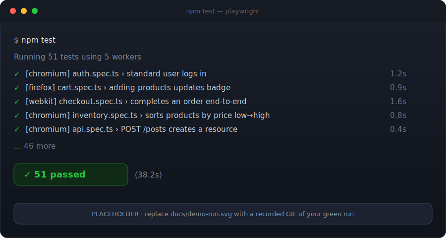
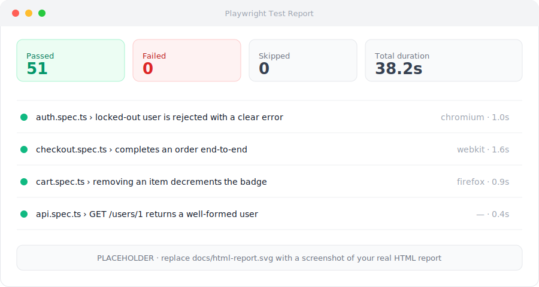

# 🎭 Playwright + MCP — Agentic E2E Testing Framework

> **AI-augmented end-to-end testing done to a senior bar:** a strict-TypeScript
> Playwright framework (Page Object Model, fixtures, cross-browser CI) **plus** a
> reproducible **Playwright-MCP agentic workflow** that turns plain-English
> acceptance criteria into reviewed, production-grade tests.

[](https://github.com/santirogu/playwright-mcp-agentic-testing/actions/workflows/ci.yml)
[](https://playwright.dev/)
[](https://www.typescriptlang.org/)
[](https://modelcontextprotocol.io/)
[](LICENSE)

---

## Why this exists

Anyone can write a Playwright script. This repo is built to demonstrate the
things a **senior SDET** is actually hired for: a maintainable architecture,
stable locators, real cross-browser CI — and the judgment to use **AI/MCP as
augmentation, not autopilot**. It tests a real public app
([SauceDemo](https://www.saucedemo.com)) and documents an end-to-end agentic
workflow a reviewer can reproduce in five minutes.



<sub>▲ Placeholder mock. Record your real green run and replace `docs/demo-run.svg`
with a GIF — see [`docs/README.md`](docs/README.md) for the one-command recipe.</sub>

<details>
<summary>📊 HTML report preview</summary>



</details>

---

## Architecture at a glance

```
src/
├── pages/                     # Page Object Model — one class per screen
│   ├── BasePage.ts            #   shared navigation + page handle
│   ├── LoginPage.ts
│   ├── InventoryPage.ts
│   ├── CartPage.ts
│   ├── CheckoutPage.ts
│   └── components/
│       └── HeaderComponent.ts # reusable header (cart badge + menu)
├── fixtures/
│   └── test.ts                # custom fixtures: injected POMs + logged-in state
└── utils/
    ├── env.ts                 # typed env access (.env → public fallbacks)
    └── test-data.ts           # products, sort options, checkout data

tests/
├── e2e/                       # 14 E2E tests: auth, inventory/sorting, cart, checkout
└── api/                       # request-context API tests (availability + REST contract)

ai/                            # 🤖 the differentiator — see ai/README.md
├── mcp.config.json            # exact Playwright-MCP server config
├── prompts/                   # plain-English acceptance criteria + system prompt
├── generated/                 # AI-generated spec, committed WITH human-review notes
└── README.md                  # planner → generator → healer, reproducible

.github/workflows/ci.yml       # sharded cross-browser CI + merged HTML report artifact
playwright.config.ts           # 3 browsers, traces/screenshots on failure, no sleeps
```

**Key design decisions**

- **Page Object Model + components** — screens are classes with intent-revealing
  methods (`addToCart('Sauce Labs Backpack')`), so specs read like acceptance
  criteria and locators live in exactly one place.
- **Custom fixtures** — page objects are injected; a `loggedInInventory` fixture
  provides an already-authenticated starting point so flow tests skip boilerplate
  while auth stays independently covered.
- **Stable locators** — role-based (`getByRole`) and SauceDemo's stable
  `data-test` hooks via `getByTestId`; **zero** brittle `nth-child` CSS.
- **No arbitrary sleeps** — everything relies on Playwright auto-waiting and
  web-first assertions (`expect(locator).toBeVisible()`), which don't flake.
- **Strict TypeScript** — `strict`, `noUncheckedIndexedAccess`,
  `noUnusedLocals`, and friends are all on.

---

## Quickstart (clone → green in < 5 min)

```bash
# 1. Clone and install
git clone https://github.com/santirogu/playwright-mcp-agentic-testing.git
cd playwright-mcp-agentic-testing
npm install

# 2. Install the Playwright browsers
npx playwright install --with-deps

# 3. (optional) configure environment — sensible public defaults work as-is
cp .env.example .env

# 4. Run the whole suite across all 3 browsers
npm test

# 5. Open the HTML report
npm run report
```

### Handy scripts

| Command                 | What it does                                        |
| ----------------------- | --------------------------------------------------- |
| `npm test`              | Run all tests, all browsers                         |
| `npm run test:chromium` | Run against Chromium only (fastest feedback)        |
| `npm run test:api`      | Run only the API-layer tests                        |
| `npm run test:ui`       | Open the Playwright UI mode (time-travel debugging) |
| `npm run test:headed`   | Run with a visible browser                          |
| `npm run report`        | Open the last HTML report                           |
| `npm run codegen`       | Launch Playwright codegen against SauceDemo         |
| `npm run lint`          | ESLint (incl. Playwright rules)                     |
| `npm run typecheck`     | `tsc --noEmit` under strict config                  |
| `npm run format`        | Prettier write                                      |

> **On `.env`:** Playwright auto-loads a local `.env` in recent versions. If your
> version doesn't, the suite still runs — `src/utils/env.ts` falls back to
> SauceDemo's documented public credentials. **No secrets are committed.**

---

## 🤖 The AI / MCP layer (the differentiator)

A full, reproducible **planner → generator → healer** workflow using the
[Playwright MCP server](https://github.com/microsoft/playwright-mcp): an agent
reads plain-English acceptance criteria, drives a **real browser** through MCP,
reads the **accessibility tree** to pick stable locators, and emits a spec
against this repo's Page Object Model.

Crucially, the generated artifact is committed **together with the human-review
notes** showing exactly what a senior engineer changed before merging — proving
augmentation, not blind shipping.

👉 **Full walkthrough + reproduction steps: [`ai/README.md`](ai/README.md)**

---

## CI/CD

[`.github/workflows/ci.yml`](.github/workflows/ci.yml) runs on every push/PR to `main`/`master`:

1. **Quality gate** — ESLint, `tsc` typecheck, and Prettier check.
2. **Tests** — a matrix of **3 browsers × 2 shards = 6 parallel jobs**, each
   emitting a blob report.
3. **Merge** — all shards' blobs are merged into a **single HTML report**,
   uploaded as an artifact (traces/screenshots included for any failure).

---

## What this demonstrates (feature → SDET competency)

| In this repo                                     | Competency it proves                       |
| ------------------------------------------------ | ------------------------------------------ |
| POM + component objects + fixtures               | Test architecture & maintainability        |
| Role-based / `data-test` locators, no sleeps     | Stable, non-flaky automation               |
| 14 E2E across auth/cart/sorting/checkout         | Coverage of happy paths **and** edge cases |
| API tests via `request` context                  | API testing beyond the UI                  |
| Strict TS + ESLint + Prettier                    | Production-grade code quality              |
| Sharded cross-browser GitHub Actions + artifacts | CI/CD & pipeline engineering               |
| Playwright-MCP planner→generator→healer workflow | **AI-augmented / agentic testing**         |
| Human-review notes on generated code             | Engineering judgment & responsible AI use  |

---

## Tech stack

Playwright · TypeScript (strict) · Node.js · Model Context Protocol (Playwright
MCP) · GitHub Actions · ESLint · Prettier.

## License

[MIT](LICENSE) — free to reuse. SauceDemo and JSONPlaceholder are public demo
services; no proprietary or copyrighted material is included.
